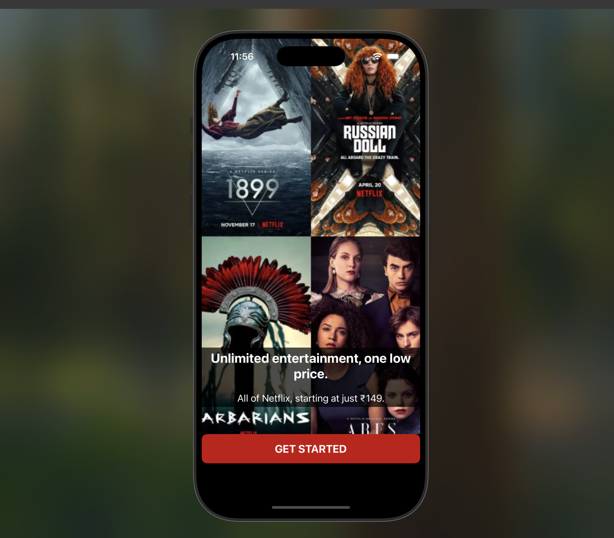
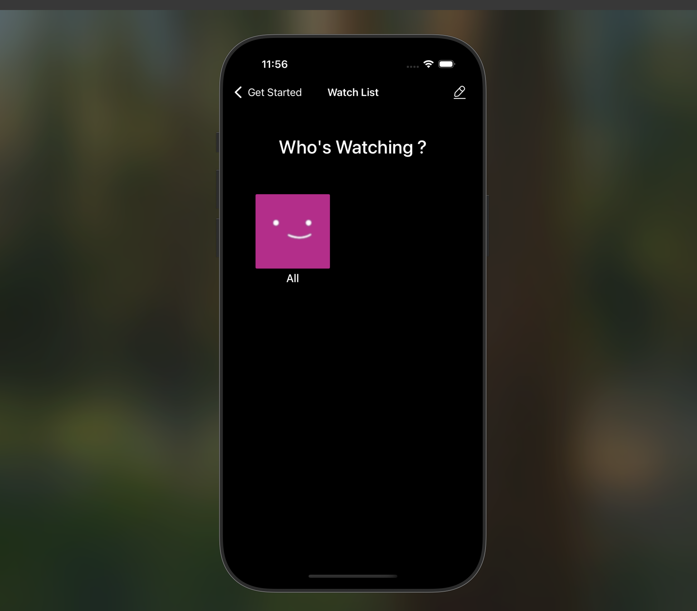
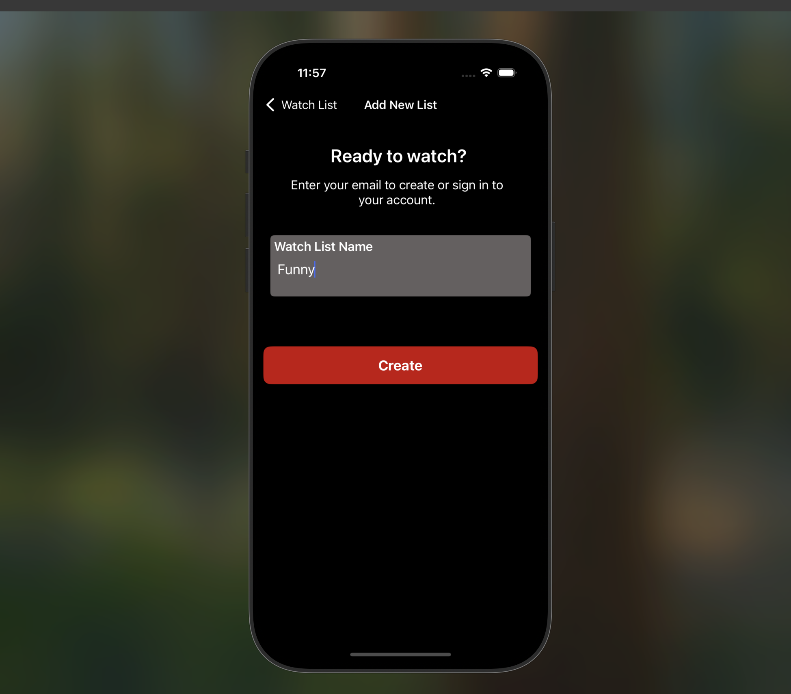
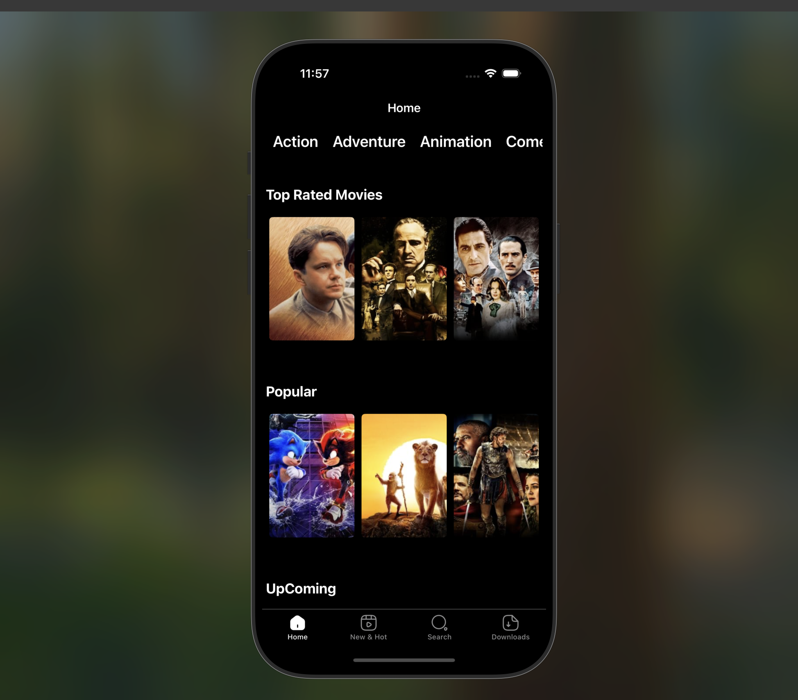
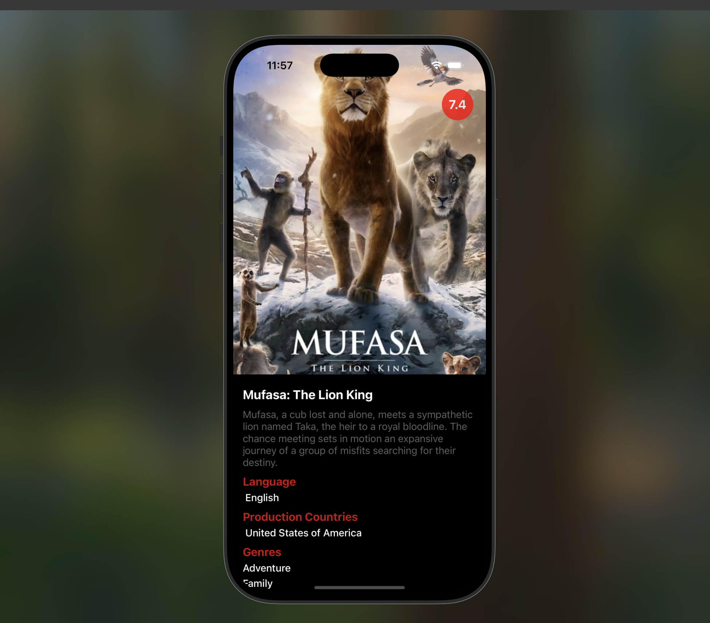

# Netflix Clone App React Native

A Netflix clone application built using React Native, Redux Toolkit for state management, and TMDb API for fetching movie data. This app showcases popular, top-rated, and upcoming movies, with detailed pages for each movie.

## Screenshots 🖼️

### Video GIF


### getStartedScreen



### watchListScreen



### addNewListScreen



### homeScreen



### movieDetailScreen



## Features

- Popular, Top-Rated, and Upcoming Movies: Browse through categorized movie lists.

- Movie Details: Access detailed information about each movie.

- Dynamic State Management: Powered by Redux Toolkit.

- Smooth Navigation: Integrated navigation for seamless user experience.

## Technologies Used

### Core Libraries

- React Native: Framework for building native apps using React.

- Redux Toolkit: Simplified state management.

- TMDb API: Source of movie data.

## Navigation

- @react-navigation/native: Navigation library for React Native.

- @react-navigation/native-stack: Stack navigator for managing screen transitions.

- @react-navigation/bottom-tabs: Bottom tab navigation

## Utilities

- axios: For HTTP requests.

- formik: Simplifies form management.

- yup: Validation schema for forms.

## Setup

### Prerequisites

- Node.js and npm installed.

- React Native development environment set up (React Native CLI).

## Installation

Follow these steps to run the project on your local machine:

Clone the Repository:

```
git clone https://github.com/ozerbaykal/Netflix-React-Native.git
```

Navigate to the Project Directory:

```
cd Netflix-React-Native
```

Install Dependencies:

```
npm install

# or

yarn install
```

Start the Metro Bundler:

```
npx react-native start
```

Run the Application:

For iOS:

```
npx react-native run-ios
```

For Android:

```
npx react-native run-android
```

## Contributing

Contributions are welcome! Please open an issue first to discuss what you would like to change.

- 1.Fork the project
- 2.Create your feature branch (git checkout -b feature/NewFeature)
- 3.Commit your changes (git commit -m 'Add new feature')
- 4.Push to the branch (git push origin feature/NewFeature)
- 5.Open a Pull Request

## Contact 📬

**Özer BAYKAL**  
Email: [baykalozer87@gmail.com](mailto:baykalozer87@gmail.com)  
Project Link: [netflix-clone-react-native](https://github.com/ozerbaykal/Netflix-React-Native)
